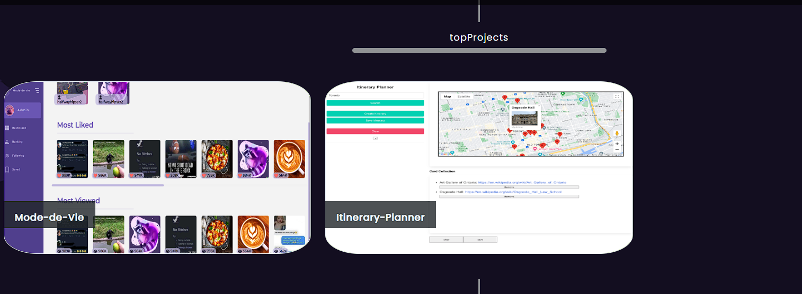

# 20-React-React-Portfolio

### Description
---

Welcome to my React-constructed portfolio. This platform showcases a blend of individual and collaborative projects I've undertaken. Beyond the projects, it provides an insight into my professional journey, an accessible contact form, and a dedicated section for my resume. Explore and get acquainted with my work.

---
 
 
 [🌟 Carlos Dela Cruz's Portfolio 🌟](https://cdelacruzzin.github.io/20-React-React-Portfolio/) 

## Table of Contents

- [20-React-React-Portfolio](#20-react-react-portfolio)
    - [Description](#description)
  - [Table of Contents](#table-of-contents)
  - [Installation](#installation)
  - [Usage](#usage)
  - [Credits](#credits)
  - [License](#license)

## Installation

To install my portfolio, simply open the app and click the icon in the browser search bar on the top right.

## Usage
First, you'll land on the "About Me" section, displaying my photo, a brief biography, and my skills. On the header, there's a navbar guiding you through the various sections of my portfolio.

At the bottom, you will find clickable icons, which lead to my Github, LinkedIn, email, and resume.

Clicking on "Projects" in the navbar directs you to a page showcasing my projects. Hovering over each project not only reveals its title, which links to the live application when clicked, but also provides a brief description of the app. Additionally, a GitHub icon is present, guiding you to the project's repository.

Once you get to the contact section, you will find a form, where you can enter your contact information. 
If you move the cursor out of the form fields and click, you will see a notification, of which fields are missing.

## Credits

Carlos Dela Cruz

## License

This is a MIT Licensed product.